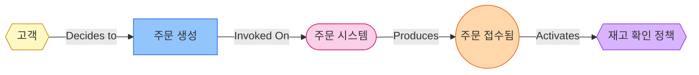

# Event Storming 구성요소 상세 스펙

## Mermaid 스타일 정의

```mermaid
flowchart LR
    classDef actor fill:#fef9c3,stroke:#ca8a04
    classDef command fill:#93c5fd,stroke:#2563eb
    classDef system fill:#fbcfe8,stroke:#db2777
    classDef event fill:#fed7aa,stroke:#ea580c
    classDef policy fill:#d8b4fe,stroke:#9333ea
    classDef query fill:#bbf7d0,stroke:#16a34a
    classDef constraint fill:#fef08a,stroke:#ca8a04
    classDef hotspot fill:#fecaca,stroke:#dc2626
```

## 구성요소 정의

### 1. Actor/Agent (행위자)

| 속성 | 값 |
|-----|-----|
| 색상 (fill) | #fef9c3 (연한 노란색) |
| 테두리 (stroke) | #ca8a04 |
| Mermaid 노드 | `{{"고객"}}` (hexagon) |
| 설명 | 프로세스에 참여하는 인물, 팀, 외부 시스템 |

**예시:**
- 고객
- 관리자
- 배송팀
- 외부 결제 게이트웨이

---

### 2. Command/Action (명령)

| 속성 | 값 |
|-----|-----|
| 색상 (fill) | #93c5fd (연한 파란색) |
| 테두리 (stroke) | #2563eb |
| Mermaid 노드 | `["주문 생성"]` (rectangle) |
| 설명 | Actor가 시스템에 요청하는 행위, 의도 |

**예시:**
- 주문 생성
- 결제 요청
- 배송 시작

**작성 규칙:**
- 동사형으로 작성 (예: "생성", "요청", "시작")

---

### 3. System (시스템)

| 속성 | 값 |
|-----|-----|
| 색상 (fill) | #fbcfe8 (연한 분홍색) |
| 테두리 (stroke) | #db2777 |
| Mermaid 노드 | `(["주문 시스템"])` (stadium) |
| 설명 | Command를 처리하고 Event를 발생시키는 IT 시스템 |

**예시:**
- 주문 시스템
- 결제 시스템
- 재고 관리 시스템

---

### 4. Domain Event (도메인 이벤트)

| 속성 | 값 |
|-----|-----|
| 색상 (fill) | #fed7aa (연한 주황색) |
| 테두리 (stroke) | #ea580c |
| Mermaid 노드 | `(("주문 접수됨"))` (circle) |
| 설명 | 시스템에서 발생한 비즈니스적으로 의미 있는 사건 |

**예시:**
- 주문이 접수됨
- 결제가 완료됨
- 상품이 배송됨

**작성 규칙:**
- **항상 과거형**으로 작성
- "~됨", "~완료됨", "~실패함" 형태

---

### 5. Policy (정책)

| 속성 | 값 |
|-----|-----|
| 색상 (fill) | #d8b4fe (연한 보라색) |
| 테두리 (stroke) | #9333ea |
| Mermaid 노드 | `{{"재고 확인 정책"}}` (diamond) |
| 설명 | Event 발생 시 자동으로 실행되는 비즈니스 규칙 |

**예시:**
- 주문 접수 시 → 재고 확인
- 결제 완료 시 → 주문 확정
- 배송 완료 시 → 완료 알림 발송

**작성 규칙:**
- "Whenever [Event], then [Action]" 형태
- 또는 한국어로 "[Event] 시 → [Action]"

---

### 6. Query Model (조회 모델)

| 속성 | 값 |
|-----|-----|
| 색상 (fill) | #bbf7d0 (연한 연두색) |
| 테두리 (stroke) | #16a34a |
| Mermaid 노드 | `[/"재고 현황"/]` (parallelogram) |
| 설명 | Actor가 의사결정에 필요한 정보/데이터 |

**예시:**
- 상품 목록
- 재고 현황
- 주문 이력

---

### 7. Constraint (제약조건)

| 속성 | 값 |
|-----|-----|
| 색상 (fill) | #fef08a (연한 노란색) |
| 테두리 (stroke) | #ca8a04 |
| Mermaid 노드 | `[["재고 확인"]]` (subroutine) |
| 설명 | Command 실행 전 충족해야 하는 조건 |

**예시:**
- 재고 >= 주문수량
- 결제 한도 내
- 회원 등급 확인

---

### 8. Hotspot (논쟁점)

| 속성 | 값 |
|-----|-----|
| 색상 (fill) | #fecaca (연한 빨간색) |
| 테두리 (stroke) | #dc2626 |
| Mermaid 노드 | `(((("미정"))))` (double circle) |
| 설명 | 불확실하거나 논쟁이 필요한 부분 |

**예시:**
- 환불 정책 미정
- 타임아웃 기준 논의 필요
- 외부 시스템 연동 방법 미결정

---

## 연결 규칙

### 기본 흐름

```
Actor ──Decides to──> Command ──Invoked On──> System ──Produces──> Domain Event
                                                                        │
                                                                   Activates
                                                                        │
                                                                        v
Actor <──observes── Query Model <──Results in── Policy <─────────────────┘
```

### 연결 타입별 라벨

| From | To | Label | 설명 |
|------|-----|-------|------|
| Actor | Command | "Decides to" | Actor가 Command를 결정 |
| Command | System | "Invoked On" | Command가 System을 호출 |
| System | Domain Event | "Produces" | System이 Event를 발생 |
| Domain Event | Policy | "Activates" | Event가 Policy를 활성화 |
| Policy | Command | "Issues" | Policy가 새 Command 발행 |
| Domain Event | Query Model | "Results in" | Event가 Query Model 생성 |
| Query Model | Actor | "observes" | Actor가 Query Model 참조 |
| Constraint | Command | "guards" | Constraint가 Command 보호 |
| Hotspot | (any) | "?" | 불확실한 관계 |

---

## Mermaid 완전 예제

### 입력 JSON

```json
{
  "title": "주문 처리 프로세스",
  "type": "process_modelling",
  "components": [
    {"type": "domain_event", "name": "주문 접수됨", "id": "e1"},
    {"type": "actor", "name": "고객", "id": "a1"},
    {"type": "command", "name": "주문 생성", "id": "c1"},
    {"type": "system", "name": "주문 시스템", "id": "s1"},
    {"type": "policy", "name": "재고 확인 정책", "id": "p1"}
  ],
  "connections": [
    {"from": "a1", "to": "c1", "label": "Decides to"},
    {"from": "c1", "to": "s1", "label": "Invoked On"},
    {"from": "s1", "to": "e1", "label": "Produces"},
    {"from": "e1", "to": "p1", "label": "Activates"}
  ]
}
```

### 출력 Mermaid



---

## 입력 JSON 스키마

```json
{
  "$schema": "http://json-schema.org/draft-07/schema#",
  "type": "object",
  "required": ["title", "components"],
  "properties": {
    "title": {
      "type": "string",
      "description": "다이어그램 제목"
    },
    "type": {
      "type": "string",
      "enum": ["process_modelling", "software_design"],
      "description": "이벤트 스토밍 유형"
    },
    "components": {
      "type": "array",
      "items": {
        "type": "object",
        "required": ["type", "name", "id"],
        "properties": {
          "type": {
            "type": "string",
            "enum": ["actor", "command", "system", "domain_event", "policy", "query_model", "constraint", "hotspot"]
          },
          "name": {
            "type": "string"
          },
          "id": {
            "type": "string"
          }
        }
      }
    },
    "connections": {
      "type": "array",
      "items": {
        "type": "object",
        "required": ["from", "to"],
        "properties": {
          "from": {
            "type": "string",
            "description": "시작 구성요소 ID"
          },
          "to": {
            "type": "string",
            "description": "끝 구성요소 ID"
          },
          "label": {
            "type": "string",
            "description": "연결 라벨 (생략 시 기본 라벨 사용)"
          }
        }
      }
    }
  }
}
```
